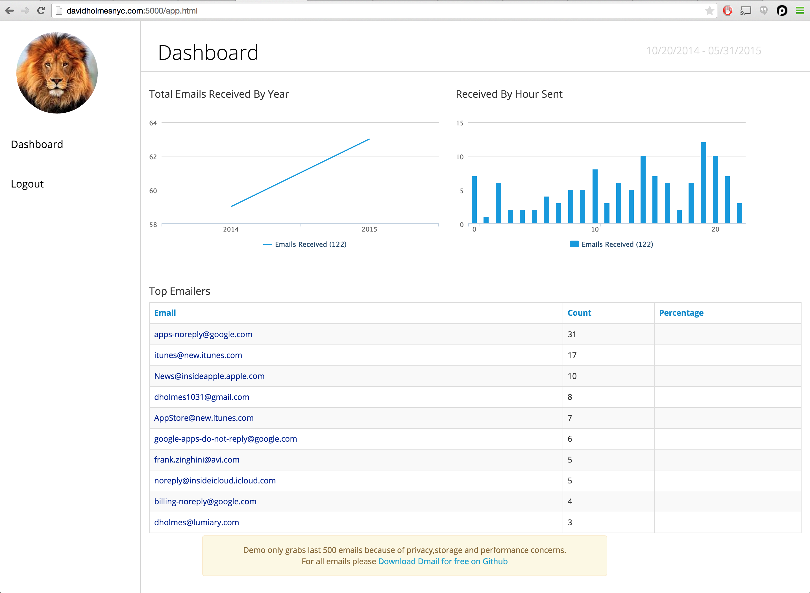

# Dmail 0.1 Alpha
Historical Gmail Analytics written in node.js using sqlite3 

##Screenshots 


<br/>

<br/>

<br/>

<br/>

##How to install 
```
git clone https://github.com/davidholmesnyc/dmail.git

cd dmail

npm install sqlite3
```

##Edit Your config 
```javascript
{
  "google":{
    "CLIENTID":"YOUR GOOGLE CLIENT ID ",
    "CLIENTSECRET":"YOUR GOOGLE CLIENT SECERT",
    "REDIRECTURL":"YOUR GOOGLE OAUTH REDIRECTURL URL",
    
    "SCOPES":[
      'https://www.googleapis.com/auth/gmail.readonly',
      'https://www.googleapis.com/auth/userinfo.email',
      'https://mail.google.com/'
    ]
  },
  "EMAIL_LIMIT":0, // 0 = unlimited  // Do negatives to get last emails for example -10 gets last 10 emails
  "PORT":5000,
  "DATABASE":"emails.db",
  "COOKIESECRET":"blklaslknn3i093248021"
}
```

##Todo 
Add test units
add to npm -- install should be as simple as npm install dmail 


